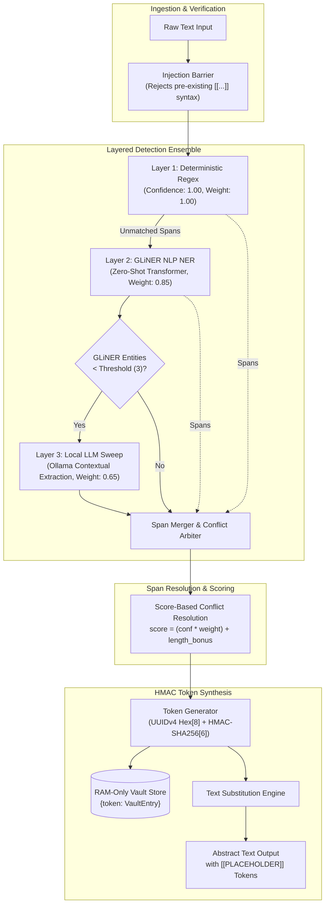
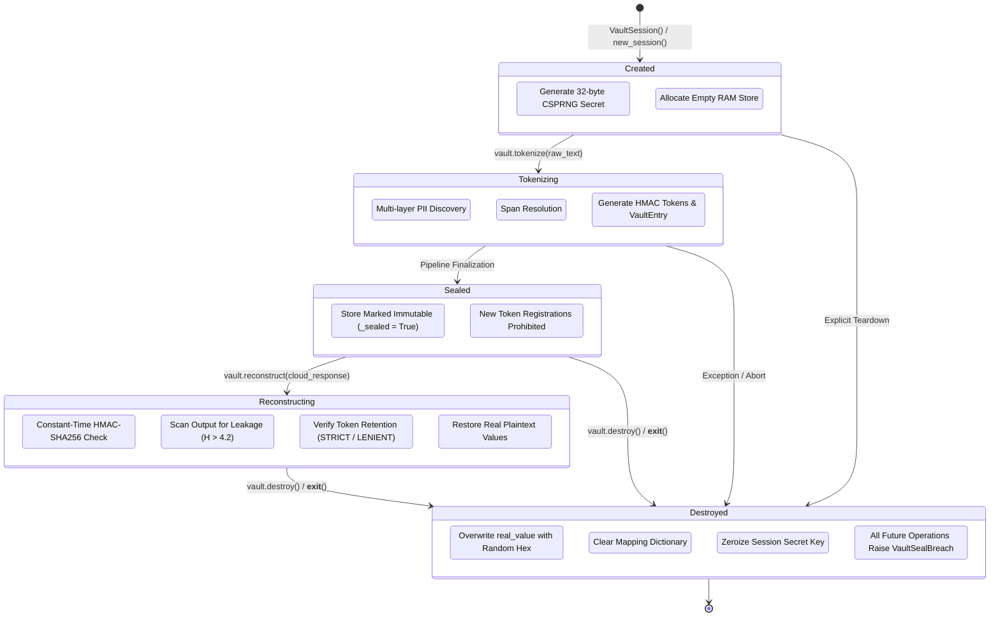

# Sovereign Vault — System Architecture

**Reversible Cryptographic PII Tokenization for Untrusted LLM Pipelines**  
*Specification Version: 1.0.1*

---

## 1. Overview

Sovereign Vault is a high-performance, session-scoped privacy proxy designed to eliminate PII/PHI exposure when utilizing untrusted, multi-tenant cloud Large Language Models (e.g., Anthropic Claude, OpenAI GPT, Google Gemini). Traditional irreversible redaction (`[REDACTED]`) destroys data topology and referential integrity, preventing language models from analyzing cross-entity relationships, transactional flows, or temporal sequences. Sovereign Vault solves this by substituting sensitive direct and indirect identifiers with deterministic, session-scoped, HMAC-authenticated placeholder tokens prior to network egress. The remote model performs reasoning exclusively over abstract surrogates, after which plaintext identifiers are restored locally within the trusted perimeter. The mapping dictionary is held exclusively in volatile RAM and is cryptographically wiped upon session termination.

---

## 2. Detection Pipeline

The detection pipeline executes an ensemble architecture across three sequential tiers, balancing deterministic precision, contextual NLP entity extraction, and local LLM semantic inference.



### 2.1 Pipeline Execution Dynamics

1. **Injection Screening**: Before any entity parsing occurs, the input string is evaluated against `_VAULT_TOKEN_RE`. If reserved placeholder syntax (`[[LABEL_...]]`) is detected in the input, execution aborts immediately with a `VaultSealBreach` to prevent adversarial token injection.
2. **Layer 1 — Deterministic Regex (`confidence = 1.00`, `weight = 1.00`)**: Evaluates high-entropy structured identifiers:
   - Social Security Numbers (SSN), Phone numbers (E.164 / domestic formats)
   - Email addresses (RFC 5322), IPv4 addresses
   - Payment Card Industry data (Credit cards via Luhn structural patterns)
   - Government and legal identifiers (Passports, Michigan Driver Licenses, Court Case numbers)
3. **Layer 2 — GLiNER Zero-Shot Transformer (`confidence = model_score`, `weight = 0.85`)**: Executes open-vocabulary entity classification using the lightweight bidirectional transformer `knowledgator/gliner-pii-base-v1.0`. Identifies named entities including `PERSON`, `ORGANIZATION`, `LOCATION`, `ADDRESS`, `DATE_OF_BIRTH`, `FINANCIAL_ACCOUNT`, `GOVERNMENT_ID`, `VEHICLE_REGISTRATION`, and `MEDICAL_RECORD_NUMBER`.
4. **Layer 3 — Ollama Contextual Sweep (`confidence = 0.65`, `weight = 0.65`)**: Dynamically triggered only when Layer 2 discovers fewer than three entities (`ollama_trigger_threshold = 3`). Invokes a local model (e.g., `gemma2:latest`) via zero-temperature inference to isolate implicit, role-based identifiers (e.g., *"the defense counsel"*, *"Account #XYZ"*, *"the presiding judge"*).
5. **Span Merger Arbitration**: Spans across all three layers are normalized into `_Span` objects and sorted by start character offset and descending score. Where overlaps occur, the Span Merger arbitrates using:
   $$\text{Score} = (\text{Confidence} \times \text{Weight}_{\text{source}}) + \min\left(\frac{\text{len}(\text{value})}{50.0},\, 0.1\right)$$
   Higher-scoring spans preempt lower-scoring spans; longer exact substrings receive a bounded length bonus.

---

## 3. HMAC Token Lifecycle

Every vaulted entity is assigned a cryptographically authenticated surrogate token whose structure guarantees uniqueness, non-invertibility without the session secret, and tamper resistance.

```
       ┌────────────────────────────────────────────────────────┐
       │                   Vault Token Anatomy                  │
       └────────────────────────────────────────────────────────┘
         [[  LABEL  _  UUID8      _  HMAC6   ]]
          │    │         │             │     │
   Prefix ┘    │         │             │     └ Suffix
               │         │             │
        Entity Type   Collision     Integrity
        (e.g., SSN,   Prevention    Signature
          PERSON)     (8 hex chars) (6 hex chars)
```

### 3.1 Token Generation Mechanics

1. **Session Secret Initialization**: Upon instantiation of a `VaultSession`, a 256-bit cryptographically secure pseudorandom key is generated via `secrets.token_bytes(32)`. This secret is never written to non-volatile storage, never exported, and exists solely within the executing process memory.
2. **Key Construction**:
   - `short_id`: Extracted from a freshly minted UUIDv4: `uuid.uuid4().hex[:8].upper()`.
   - `base_key`: Formatted as `{LABEL}_{short_id}` (e.g., `PERSON_A1B2C3D4`).
   - `tag`: The first 6 hexadecimal characters of a SHA-256 HMAC:
     $$\text{tag} = \text{HMAC-SHA256}_{K_{\text{session}}}(\text{base\_key})[0:6]$$
   - `token`: Fully framed token string: `[[PERSON_A1B2C3D4_e5f6a7]]`.
3. **Storage Allocation**: An internal dataclass `VaultEntry` captures the plaintext value, classification label, detection layer, confidence score, composite span score, and character boundaries. This entry is stored in `self._store[token]`.

### 3.2 Integrity Verification & Injection Prevention

During local reconstruction (`vault.reconstruct()`), the session performs multi-stage verification:
- **Registry Membership**: Every token present in the received cloud response is checked against `self._store`. Any token matching the format `[[...]]` that is not registered raises `VaultSealBreach`.
- **Cryptographic Verification**: For registered tokens, the base key is re-hashed against `self._secret` and evaluated using constant-time equality (`hmac.compare_digest(tag, expected)`). If an external actor attempts to forge or modify a placeholder, the HMAC check fails and triggers an immediate `VaultSealBreach`.
- **Entropy Leak Detection**: The cloud response is split into tokens and evaluated against Shannon entropy:
  $$H(X) = -\sum_{i=1}^{n} P(x_i) \log_2 P(x_i)$$
  Any token exceeding $H(X) > 4.2$ that does not conform to the known vault key schema is flagged as a potential un-vaulted or hallucinated identifier leak.

### 3.3 Memory Scrambling and Deallocation

Upon invocation of `vault.destroy()` (or exiting the context manager):
1. Every `real_value` string in `self._store` is actively overwritten with cryptographically random hexadecimal bytes of identical length using `secrets.token_hex(len(real_value))`.
2. The `hmac_tag` is cleared.
3. The dictionary `_store` is purged via `.clear()`.
4. `self._secret` is overwritten with an empty byte string (`b""`).
5. `self._destroyed` is flagged as `True`. Any subsequent invocation of `.tokenize()`, `.reconstruct()`, or `.audit_log()` raises `VaultSealBreach`.

---

## 4. Session Lifecycle

A `VaultSession` operates as a strictly monotonic finite state machine. Backward transitions are disallowed.



---

## 5. Reconstruction Modes

Reconstruction behavior is governed by two orthogonal enumerations: `ReconMode` (handling missing tokens) and `SealMode` (handling irreversible operations).

| Mode Configuration | Behavior on Missing Tokens | Behavior on Unknown / Tampered Tokens | Exception Raised | Primary Operational Use Case |
|---|---|---|---|---|
| **`ReconMode.STRICT`** *(Default)* | Fails immediately if any token generated during `tokenize()` is omitted in the cloud output. | Hard stop. Triggers immediate exception. | `VaultReconstructionDegraded` (missing token)<br/>`VaultSealBreach` (tampered token) | **Regulated Legal & Forensic Workflows**: Contracts, medical charts, and court filings where dropping an entity alters semantic or evidentiary meaning. |
| **`ReconMode.LENIENT`** | Permits missing tokens; substitutes all found tokens and logs missing keys as warnings. | Hard stop. Triggers immediate exception. | `VaultSealBreach` (tampered token only) | **Extractive & Generative Summarization**: Executive summaries, bullet-point distillations, or QA where the model intentionally elides tangential entities. |
| **`SealMode.SEALED`** | Reconstruction is permanently disabled; vault operates as an irreversible pseudonymizer. | Hard stop if `reconstruct()` is invoked. | `VaultSealBreach` (if `reconstruct()` is attempted) | **Archival & External Dissemination**: Output is intended for public benchmarks, anonymized datasets, or multi-tenant analytics where cleartext must never be recoverable. |

---

## 6. Security Properties

Sovereign Vault is engineered to satisfy the rigorous zero-trust requirements of AI security researchers and forensic auditors:

1. **Injection Prevention**: Input payloads containing reserved placeholder framing (`[[...]]`) are rejected during pre-flight checks before entering regex or NLP layers, preventing prompt injection techniques aimed at spoofing vault markers.
2. **HMAC Integrity Authentication**: Every surrogate token is tied to a 256-bit ephemeral secret using HMAC-SHA256 truncated to 24 bits of entropy (6 hex chars). Remote LLMs or adversarial third parties cannot manufacture valid placeholders without triggering cryptographic validation failures.
3. **Entropy Leak Detection**: Evaluates post-inference cloud outputs for anomalous Shannon entropy ($H > 4.2$) across untokenized alphanumeric sequences $\ge 8$ characters, alerting security engineers to potential model-generated identifiers, leaked hashes, or bypass tokens.
4. **Zero Non-Volatile Persistence (RAM-Only)**: The cryptographic secret, entity mappings, and original plaintext values exist exclusively in volatile heap memory. No temporary files, disk caching, or swap writes are ever performed by the core library.
5. **Active Memory Sanitization**: Destructive teardown (`destroy()`) implements active memory overwriting by replacing plaintext strings with random hexadecimal noise before releasing dictionary references, minimizing memory exposure to subsequent process dumps.
6. **Isolated Cryptographic Boundaries**: Sessions generated via `new_session()` or `VaultSession()` maintain unique 32-byte secret keys. Tokens generated in Session A are cryptographically invalid and non-reconstructible in Session B.
7. **Privilege-Free Local Execution**: Core detection (Layer 1) executes deterministically with zero external API calls, network sockets, or sub-processes.
