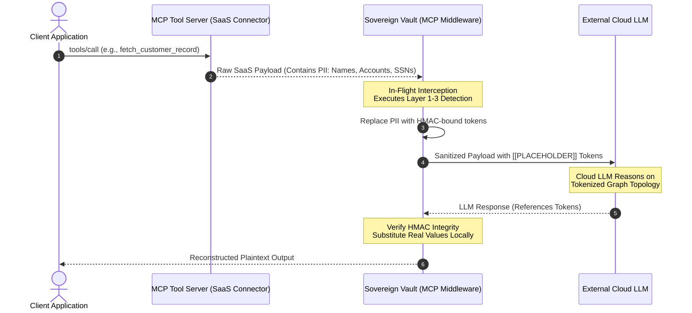
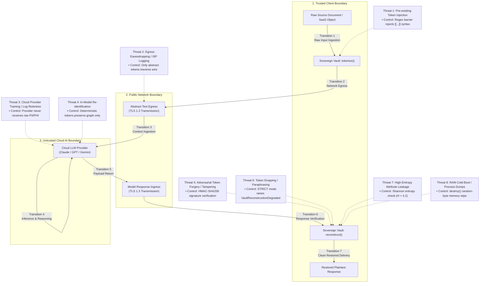

# Sovereign Vault — Threat Model & Security Analysis

**Formal Risk Assessment and Security Architecture for LLM Privacy Pipelines**  
*Document Version: 1.0.1*

---

## 1. Threat Landscape

Modern enterprise AI applications increasingly depend on frontier cloud Large Language Models (e.g., Anthropic Claude, OpenAI GPT-4, Google Gemini). These models require sending context windows containing hundreds of thousands of tokens across external network boundaries into multi-tenant cloud infrastructure. Ingesting unstructured organizational data—such as legal discovery files, human resources correspondence, clinical transcripts, and financial ledgers—introduces severe security and regulatory risks:

- **Third-Party Model Ingestion & Training**: Data transmitted to cloud providers risks accidental ingestion into training corpuses, evaluation fine-tuning pools, or telemetry caches unless strict enterprise zero-data-retention agreements are configured and verified.
- **Provider-Side Data Breaches & Subpoenas**: Cleartext PII residing in provider prompt logs, telemetry databases, or debug mirrors is vulnerable to compromise by insider threats, external breaches, or foreign extraterritorial legal requests (e.g., US CLOUD Act queries against non-US entity data).
- **Cross-Tenant Context Contamination**: Multi-tenant inference infrastructure, speculative decoding caches, and KV-cache reuse optimizations introduce non-zero risks of cross-request memory bleeding.
- **Irreversible Redaction Failure**: Traditional redaction (replacing values with `[REDACTED]`) strips semantic co-reference. Consequently, developers frequently bypass redaction to maintain model analytical fidelity, directly triggering severe compliance violations.

Sovereign Vault acts as a zero-trust cryptographic perimeter, guaranteeing that **no raw PII ever traverses the network boundary**, while simultaneously preserving referential and structural context for downstream LLM reasoning.

---

## 2. OWASP Top 10 for LLM Applications Mapping

Sovereign Vault directly counters the primary attack vectors codified in the OWASP Top 10 for Large Language Model Applications.

```
┌─────────────────────────────────────────────────────────────────────────────┐
│                 OWASP LLM Top 10 Countermeasure Mapping                     │
├──────────────────────┬─────────────────────────┬────────────────────────────┤
│ OWASP Vulnerability  │ Threat Vector           │ Sovereign Vault Control    │
├──────────────────────┼─────────────────────────┼────────────────────────────┤
│ LLM01: Prompt        │ Adversary crafts fake   │ Pre-ingestion token regex  │
│ Injection            │ tokens in input to      │ barrier blocks reserved    │
│                      │ poison reconstruction.  │ [[...]] syntax instantly.  │
├──────────────────────┼─────────────────────────┼────────────────────────────┤
│ LLM06: Sensitive     │ PII/PHI egresses to     │ Reversible surrogate       │
│ Information          │ cloud model context,    │ tokenization replaces all  │
│ Disclosure           │ leading to exposure.    │ identifiers with tokens.   │
├──────────────────────┼─────────────────────────┼────────────────────────────┤
│ LLM09: System &      │ Downstream or model-    │ HMAC-SHA256 signature on   │
│ Supply Chain         │ injected fake tokens    │ every token prevents       │
│ Vulnerabilities      │ corrupt local state.    │ unauthorized fabrication.  │
└──────────────────────┴─────────────────────────┴────────────────────────────┘
```

### 2.1 LLM01: Prompt Injection

- **Vulnerability Scenario**: An adversary crafts an input document containing synthetic vault tokens (e.g., `[[PERSON_ROOT001_a1b2c3]]`) or prompt instructions designed to fool the local reconstructor into swapping arbitrary text strings into executive documents or financial orders.
- **Sovereign Vault Mitigation**: Before executing regex or NLP passes, `vault.tokenize()` evaluates raw input with the pattern:
  ```python
  _VAULT_TOKEN_RE = re.compile(r'\[\[[A-Z][A-Za-z0-9_]*_[a-f0-9]{6,}\]\]')
  ```
  If any reserved token structure is discovered, execution raises `VaultSealBreach` immediately and halts. The pipeline refuses to tokenize pre-structured or maliciously formatted payloads.

### 2.2 LLM06: Sensitive Information Disclosure

- **Vulnerability Scenario**: Raw client records (SSNs, personal phone numbers, bank accounts, home addresses) are ingested by automated agents, sent across the public Internet to third-party model endpoints, and stored in cloud inference logs.
- **Sovereign Vault Mitigation**: A 3-layer deterministic and probabilistic pipeline substitutes all direct identifiers with HMAC-bound placeholders (e.g., `[[SSN_D4E5F6A7_1c2d3e]]`). The remote inference provider only ever receives anonymized surrogates. Plaintext reconstruction is strictly local, occurring only after the response returns to the authenticated internal client.

### 2.3 LLM09: Supply Chain & System Integrity

- **Vulnerability Scenario**: A compromised model provider, a man-in-the-middle proxy, or a malicious tool in an agentic swarm attempts to forge or manipulate vault tokens, substituting malicious values during reconstruction.
- **Sovereign Vault Mitigation**: Every token generated by Sovereign Vault carries an HMAC tag derived from a 256-bit cryptographically secure session key (`secrets.token_bytes(32)`):
  $$\text{Tag} = \text{HMAC-SHA256}_{K_{\text{session}}}(\text{LABEL\_UUID8})[0:6]$$
  During `vault.reconstruct()`, every placeholder in the model's response is validated against the active session store and re-verified via constant-time comparison (`hmac.compare_digest`). Unknown tokens or modified tags immediately raise `VaultSealBreach`.

---

## 3. Model Context Protocol (MCP) Exfiltration Vector

In modern agentic ecosystems (such as the LexiPro Sovereign OS), agents frequently utilize the Model Context Protocol (MCP) to invoke external tools and query SaaS platforms (e.g., Salesforce, Jira, Zendesk, Slack, PostgreSQL, Stripe).



### The Exfiltration Risk

When MCP tool servers fetch live operational records, the raw tool return payloads are typically injected directly into the LLM context window. This creates a critical egress channel where internal customer data, credentials, and confidential customer support notes leak directly to external model vendors without the user's explicit realization.

### Sovereign Vault Mitigation

Sovereign Vault functions as an in-line **MCP middleware proxy**. By intercepting standard JSON-RPC 2.0 messages (`tools/call`, `resources/read`, and `prompts/get`), Sovereign Vault tokenizes all payload text *before* it is injected into the LLM context window. The cloud model reasons over tokenized SaaS objects, and Sovereign Vault restores the cleartext values once the completed plan or message returns to the user boundary.

---

## 4. Quasi-Identifier Re-identification

### 4.1 The Re-identification Risk

Direct identifiers (names, Social Security Numbers, email addresses) are not the sole means of identifying individuals. Under Latanya Sweeney’s landmark $k$-anonymity research (2002), **87% of the United States population can be uniquely identified by the combination of just three quasi-identifiers**:
$$\{\text{5-Digit ZIP Code},\, \text{Gender},\, \text{Date of Birth}\}$$

In unstructured LLM prompts, high-dimensional combinations of seemingly innocuous attributes can facilitate re-identification attacks:
$$\{\text{"Chief Architect"},\, \text{"diagnosed with Stiff-Person Syndrome"},\, \text{"living in Traverse City, MI"}\}$$

Even if the individual's name is replaced with `[[PERSON_...]]`, an external LLM with broad web-crawled knowledge can correlate these attributes against public sources (e.g., LinkedIn, local news, conference agendas) to deanonymize the subject.

### 4.2 Future Mitigation: AURA-Inspired Adaptive Scope Expansion

To address quasi-identifier leakage, the Sovereign Vault development roadmap incorporates **Adaptive Scope Expansion** inspired by the AURA (Automated Uncertainty & Risk Analysis) framework:

1. **Contextual Co-occurrence Graphing**: When multiple low-confidence or quasi-identifying attributes (e.g., job role, specialized diagnosis, geographic municipality) co-occur within a defined token window, Sovereign Vault will compute a joint re-identification entropy score:
   $$R_{\text{score}} = \sum_{e \in \text{Entities}} w_e \cdot I(e) - H(\text{Context})$$
2. **Adaptive Scope Vaulting**: If $R_{\text{score}}$ exceeds a configurable threshold, the tokenization boundary automatically expands from individual named entities to the composite quasi-identifying tuple, converting:
   > *"The Chief Architect diagnosed with Stiff-Person Syndrome in Traverse City"*
   
   into:
   > *"[[QUASI_IDENTITY_CLUSTER_7F3A12_c9d0e1]]"*

This capability prevents cloud inference models from executing statistical attribute linkage against background training corpora.

---

## 5. What Sovereign Vault Does NOT Protect Against

Security researchers and compliance auditors must understand the exact operational boundaries of the library. Sovereign Vault does **not** protect against the following threat vectors:

### 5.1 Model Memorization of Narrative Subtext

If a document contains a biographical narrative or unique contextual circumstances that are inherently unique in human history (e.g., *"The 16th US President who was born in a log cabin in Kentucky and assassinated at Ford's Theatre"*), the cloud LLM will infer the subject even if every direct noun and date is replaced with a token.

### 5.2 Host Process Memory Compromise

Sovereign Vault is a software library running in user-space Python. If the host operating system, container runtime, or Python interpreter is compromised by an adversary with memory dump capabilities (e.g., `gcore`, root-level `/proc/$PID/mem` inspection), the in-RAM plaintext dictionary `self._store` can be extracted prior to `destroy()`. Sovereign Vault defends against network-level and third-party SaaS exposure, not local kernel-level compromise.

### 5.3 Hostile or Compromised LLM Paraphrasing

If an external LLM intentionally or unintentionally scrambles, hallucinates, or omits tokens:
- In `STRICT` mode, Sovereign Vault will detect the missing token and abort with `VaultReconstructionDegraded`.
- However, Sovereign Vault **cannot force** a remote model to emit valid syntax. A model that refuses to follow instructions or aggressively paraphrases will break reconstruction fidelity.

### 5.4 Access Control and Authorization

Sovereign Vault is a cryptographic pseudonymization engine, not an Identity and Access Management (IAM) system. It does not enforce role-based access control (RBAC), multi-tenant data segmentation, or file permission controls within the host application.

### 5.5 Probabilistic NER Blindspots

Novel, unformatted, or heavily obfuscated PII (e.g., leetspeak, steganographic spacing, rare cultural naming conventions) that does not trigger regex patterns and falls below the GLiNER model threshold (`0.4`) may bypass Layer 1 and Layer 2. If Layer 3 (Ollama) is disabled, such tokens may egress in cleartext. Users must monitor `vault.coverage_report()` to audit detection certainty.

---

## 6. Attack Surface Diagram

The diagram below details the entire data flow transition path, highlighting specific threat vectors and the defensive controls enforced by Sovereign Vault.


